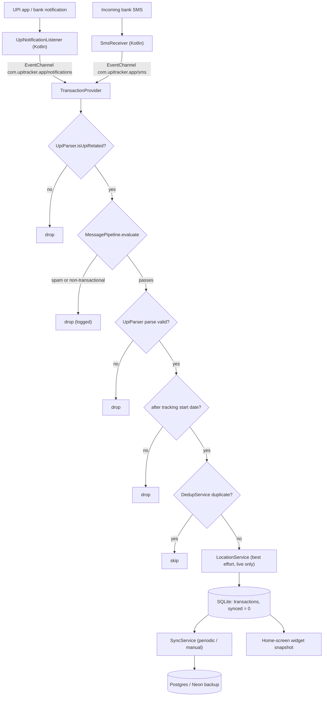

# Architecture

## System overview

UPI Tracker has four cooperating layers:

1. **Android native capture** — a `NotificationListenerService` and an SMS
   `BroadcastReceiver` (Kotlin) forward raw messages to Dart over event channels.
   See [android/native-layer.md](android/native-layer.md).
2. **Ingestion pipeline (Dart)** — keyword prefilter → stacked ML gate → regex parser →
   dedup → SQLite insert. Orchestrated by
   [lib/providers/transaction_provider.dart](../lib/providers/transaction_provider.dart).
3. **Storage & sync** — SQLite ([lib/database/local_database.dart](../lib/database/local_database.dart))
   is authoritative; Postgres ([lib/database/remote_database.dart](../lib/database/remote_database.dart))
   is a push-only backup managed by
   [lib/services/sync_service.dart](../lib/services/sync_service.dart).
4. **UI** — Material 3 screens driven by two `ChangeNotifier` providers
   (`TransactionProvider`, `DebtProvider`) via the `provider` package.

## Ingestion data flow



The same pipeline runs for three sources: live notifications, live SMS, and the
on-demand SMS history scan (`scanSmsHistory()`, up to 500 messages; skips the location
lookup). Manual entries bypass parsing/dedup entirely and get a guaranteed-unique
`manual:<uuid>` dedup hash.

## Offline-first design

- Every record is inserted locally with `synced = 0`. The UI never waits on the network.
- Sync is **one-way (local → remote)** and idempotent (`ON CONFLICT (id) DO UPDATE`).
  Only `note`, `tags` and `updated_at` are refreshed on re-push.
- A remote integrity probe (row count + oldest/newest id existence) detects out-of-band
  remote deletions and forces a full re-push via `markAllUnsynced()` — remote data loss
  heals itself; local data is never overwritten from remote.
- Local deletes do **not** propagate to remote. Debts are local-only and never synced.

Details in [features/sync.md](features/sync.md).

## Project layout

```
lib/
├── main.dart                       # entrypoint: dotenv load, MultiProvider, MaterialApp
├── app.dart                        # AppShell: IndexedStack + NavigationBar (4 tabs)
├── config/theme.dart               # Material 3 theme, debit/credit semantic colors
├── models/
│   ├── transaction_record.dart     # TransactionRecord + TransactionType
│   └── debt_entry.dart             # DebtEntry + DebtDirection
├── database/
│   ├── local_database.dart         # SQLite v2 (transactions + debts), DAO methods
│   └── remote_database.dart        # Postgres client, upsert-based sync target
├── services/
│   ├── upi_parser.dart             # regex parsing engine
│   ├── dedup_service.dart          # tiered dedup: ref/body hash + fuzzy matching
│   ├── notification_service.dart   # notification-listener bridge (Dart side)
│   ├── sms_service.dart            # SMS bridge (Dart side)
│   ├── sync_service.dart           # periodic push sync + integrity check
│   ├── location_service.dart       # geolocator + geocoding wrapper
│   └── ml/
│       ├── tfidf_logreg.dart       # shared TF-IDF + logistic-regression engine
│       ├── classifiers.dart        # SpamFilter / TransactionalClassifier / DirectionClassifier
│       └── message_pipeline.dart   # stacked cascade orchestrator
├── providers/
│   ├── transaction_provider.dart   # ingestion, filters, analytics, sync, widget refresh
│   └── debt_provider.dart          # IOU ledger state
├── screens/                        # dashboard, transactions, detail, debts, settings
└── widgets/                        # brand_logo, filter_sheet, summary_card, transaction_card

android/app/src/main/kotlin/com/example/receipt/
├── MainActivity.kt                 # all platform channels
├── UpiNotificationListener.kt      # NotificationListenerService (package allowlists)
├── SmsReceiver.kt                  # SMS_RECEIVED broadcast → internal re-broadcast
└── SpendingWidgetProvider.kt       # home-screen widget (SharedPreferences snapshot)

assets/                             # 3 committed ML model JSON blobs + branding icon
scripts/                            # Python trainer + fixture generator + Dart DB seeder
data/                               # gitignored training CSVs (see data/README.md)
test/                               # unit / integration / accuracy / widget suites
```

## State management

`provider` with two eagerly-initialized `ChangeNotifier`s created in
[lib/main.dart](../lib/main.dart):

- **`TransactionProvider`** — the central orchestrator. Owns the database singletons and
  all services, subscribes to the notification/SMS event streams, applies the ingestion
  pipeline, exposes the filtered transaction list, summaries and analytics windows, and
  pushes widget snapshots. Used by Dashboard, Transactions, Detail and Settings.
- **`DebtProvider`** — independent IOU ledger (different lifecycle, no sync/dedup/ML).
  Used only by the Debts screens.

## Environment variables

Loaded from a bundled `.env` (declared as a Flutter asset) via `flutter_dotenv`:

| Variable | Used by | Meaning |
|---|---|---|
| `DATABASE_URL` | `RemoteDatabase`, `scripts/seed_db.dart` | Postgres connection URL. SSL is forced; database name defaults to `neondb` (Neon assumption). |
| `SYNC_ENABLED` | `SyncService` | `'true'` (case-insensitive) enables sync. |
| `SYNC_INTERVAL_MINUTES` | `SyncService` | Periodic sync interval; default **15**. |

## Key dependencies

`sqflite` (local DB), `postgres` (remote), `provider` (state), `connectivity_plus`
(online check), `geolocator` + `geocoding` (location), `permission_handler`,
`shared_preferences` (tracking start date), `crypto` (MD5 dedup), `uuid`, `intl`,
`flutter_dotenv`. No ML runtime — inference is pure Dart.
