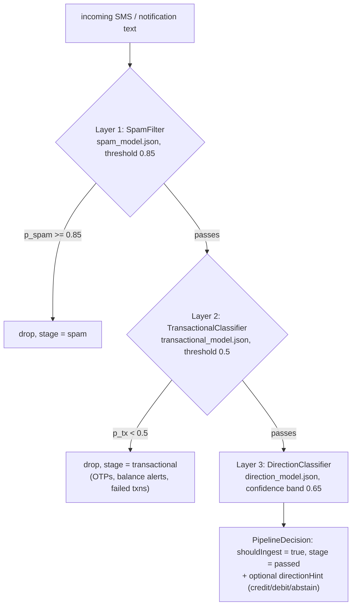

# ML pipeline

A stacked cascade of three tiny TF-IDF + logistic-regression classifiers that gates
every inbound message **before** parsing. Total on-disk payload ≈ 344 KB; inference is
pure Dart (no TFLite/ONNX/isolates). Files:

- [lib/services/ml/tfidf_logreg.dart](../../lib/services/ml/tfidf_logreg.dart) — shared engine
- [lib/services/ml/classifiers.dart](../../lib/services/ml/classifiers.dart) — three singleton wrappers
- [lib/services/ml/message_pipeline.dart](../../lib/services/ml/message_pipeline.dart) — cascade orchestrator

Training lives in Python — see [../ml-training.md](../ml-training.md).

## Cascade



Why stacked instead of one model: spam, "not a completed transaction" and direction are
three different problems needing different thresholds; ~98% of decisions short-circuit
at layer 1 (~5 µs/message); each model can be retrained independently.

## `TfidfLogReg` (shared engine)

| Member | Behavior |
|---|---|
| `load()` | Loads the JSON asset from `rootBundle`. Idempotent and concurrency-safe (`Completer` guard). **Load errors are swallowed** (debug log only) so the pipeline fails open. |
| `score(text)` | P(positive) in 0..1. Returns **0.0** if not loaded / empty vocab / empty preprocessed text; `sigmoid(bias)` if all tokens are OOV or the L2 norm is 0. |
| `predictsPositive(text, {threshold})` | `score >= (threshold ?? defaultThreshold)`. |
| `preprocess(text)` (static) | Canonical preprocessing — must stay byte-identical to `scripts/ml_core.py::preprocess`. |
| `loadFromJsonStringForTest(json)` | Test-only injection bypassing the asset bundle. |

**Preprocessing order:** lowercase → URLs → `<url>` → currency amounts (`₹`/`rs.`/`inr` +
digits) → `<amt>` → 4+ digit runs → `<num>` → remaining digits → `<d>` → strip
non-`[a-z0-9<>\s]` → collapse whitespace.

**Inference math:** unigram+bigram counts against `vocab`; raw feature =
`(1 + ln(count)) * idf`; L2-normalize; `logit = bias + Σ feature·weight`; sigmoid.

### Model JSON format

Validated at load (`StateError` on length mismatch between `vocab`/`idf`/`weights`):

| Key | Meaning |
|---|---|
| `vocab` | token → column index (bigrams as `"tok1 tok2"`) |
| `idf`, `weights` | doubles, same length as vocab |
| `bias` | number |
| `default_threshold` | optional, defaults 0.5 |
| `positive_label` / `negative_label` | optional strings |
| `version`, `kind`, `preprocessing` | informational (ignored by the Dart loader) |

Shipped models: spam (3000 features, bias −3.74, threshold **0.85**), transactional
(3000 features, bias −3.87, threshold 0.5), direction (731 features, bias +0.64,
threshold 0.5, positive = credit).

## The three classifiers

All are private-constructor singletons exposing their `TfidfLogReg` as `engine`.

**`SpamFilter`** (`assets/spam_model.json`) — precision-biased (threshold 0.85): prefers
letting spam through over dropping a real payment. Fail-open: unloaded → score 0.0 →
`isSpam` false (never blocks). API: `spamProbability`, `isSpam(text, {threshold})`.

**`TransactionalClassifier`** (`assets/transactional_model.json`) — separates real money
movement from OTPs, balance alerts, bill reminders, declined/failed transactions.
Fail-open in the opposite direction: `isTransactional` returns **true when unloaded**
(the regex parser is the next safety net). API: `transactionalProbability`,
`isTransactional(text, {threshold})`.

**`DirectionClassifier`** (`assets/direction_model.json`) — second opinion on
debit/credit. `creditProbability(text)` returns P(credit);
`predict(text, {confidence = 0.5})` returns `TxDirection.credit` if
`p >= confidence`, `TxDirection.debit` if `p <= 1 - confidence`, else `null`
(abstain). Returns `null` when unloaded.

```dart
enum TxDirection { debit, credit }
```

## `MessagePipeline`

- `MessagePipeline.instance.load()` — loads all three models in parallel
  (`Future.wait`); idempotent; failures swallowed.
- `evaluate(String text) → PipelineDecision`:
  1. Spam stage — drop if loaded and `pSpam >= 0.85`. Unloaded → `pSpam = 0.0`.
  2. Transactional stage — drop if loaded and `pTx < 0.5`. Unloaded → `pTx = 1.0`.
  3. Direction — `predict(confidence: 0.65)`: a hint is emitted only when reasonably
     confident, so disagreement warnings only fire on meaningful mismatches.

`PipelineDecision` (immutable): `shouldIngest`, `stage`
(`'spam'` / `'transactional'` / `'passed'`), `reason`, `spamProbability`,
`transactionalProbability`, `directionHint` (`TxDirection?`), `creditProbability`, and
`disagreesWithParser(TransactionType?)` — true only when both hint and parsed type are
non-null and conflict.

## Parser stays authoritative

In `TransactionProvider`, a direction disagreement is only logged
(`[pipeline] direction mismatch on … parser=… model=…`); the parsed direction is never
overridden. Worst case — all models missing or corrupt — the app degrades to its
regex-only behavior with zero dropped messages.
