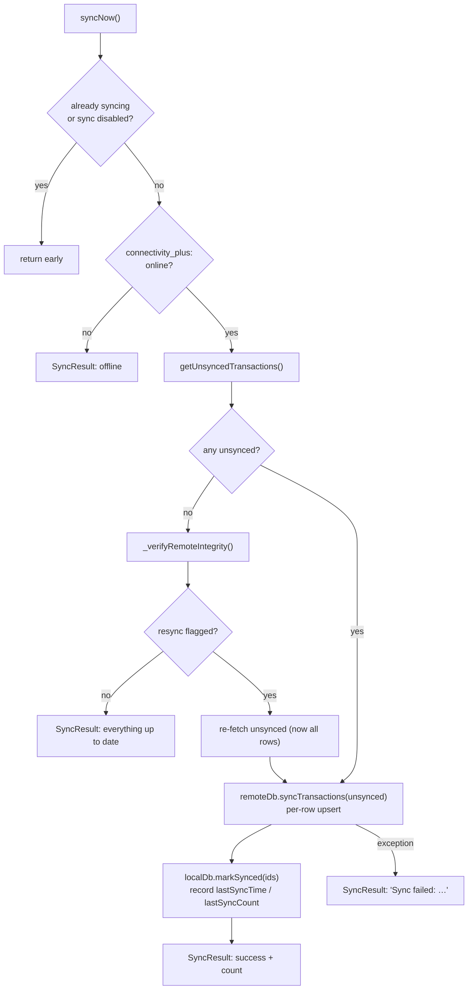

# Cloud sync

Push-only, one-way local → remote sync with a self-healing integrity check.
[lib/services/sync_service.dart](../../lib/services/sync_service.dart) drives it;
[lib/database/remote_database.dart](../../lib/database/remote_database.dart) is the
Postgres client.

## Configuration

From `.env`:

- `SYNC_ENABLED` — `'true'` (case-insensitive) enables sync (`isSyncEnabled`).
- `SYNC_INTERVAL_MINUTES` — periodic interval, default **15**; missing, unparsable, zero or
  negative values fall back to 15.
- `DATABASE_URL` — Postgres URL; SSL is forced (`SslMode.require`, which encrypts but
  does **not** verify the server certificate); database name defaults to `neondb` when
  absent (Neon assumption). Username and password are percent-decoded; query parameters
  (e.g. `channel_binding`) are ignored.

`.env` is loaded with `isOptional: true`: without it the app runs with sync disabled.

### Trust model

There is no API between the app and the database. Every install connects directly with
the **same** credential, which is packaged inside the APK (`.env` is a Flutter asset),
and writes into **one shared `transactions` table with no user or device column**. Anyone
holding an APK can read and modify every synced row, including raw SMS text and
locations. Treat sync as unsafe for anything beyond a single trusted device until an
authenticated API exists.

`startPeriodicSync()` (called from `TransactionProvider.initialize()`) runs an
immediate `syncNow()` plus a `Timer.periodic`. `stopPeriodicSync()` cancels;
`dispose()` also closes the remote connection.

## `syncNow()` algorithm



A `_isSyncing` flag prevents overlap and is reset in `finally`.

## Remote upsert semantics

`RemoteDatabase.syncTransactions` inserts each record individually (no batching) with:

```sql
ON CONFLICT (id) DO UPDATE
  SET note = EXCLUDED.note, tags = EXCLUDED.tags, updated_at = EXCLUDED.updated_at
```

So re-pushing an already-synced row only refreshes the **user-editable** fields — this
is why `updateNote`/`updateTags` flip `synced` back to false. The remote table mirrors
the SQLite schema but has **no `synced` column**; sync state is local-only. Tables and
indexes are created lazily on first connection (`_ensureTables`).

## Integrity check (`_verifyRemoteIntegrity`)

Runs only when there is nothing unsynced. Flags a full re-push
(`localDb.markAllUnsynced()`) when local count > 0 and any of:

- remote row count < local count,
- remote lacks the locally-**oldest** transaction id,
- remote lacks the locally-**newest** transaction id.

This means wiping or truncating the remote database triggers a complete re-push on the
next sync rather than silent divergence. Probe errors are swallowed (treated as
"no resync").

## Asymmetries to know

- **Deletes never propagate** — deleting locally leaves the remote row in place.
- Only `note`/`tags`/`updated_at` are updated on conflict; other field changes on an
  already-synced row would not reach remote.
- **Debts are never synced** — the `debts` table is local-only.
- `SyncResult { success, message, count }` is what surfaces in snackbars and the
  Settings sync-status tile.
